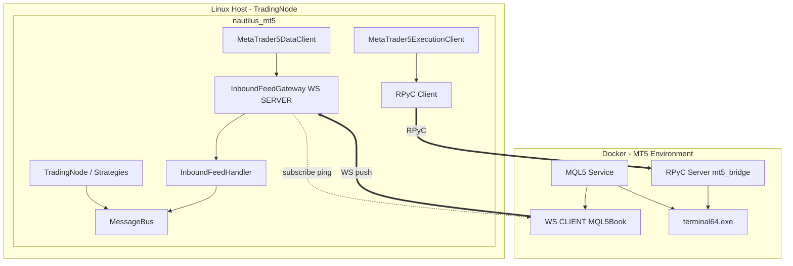
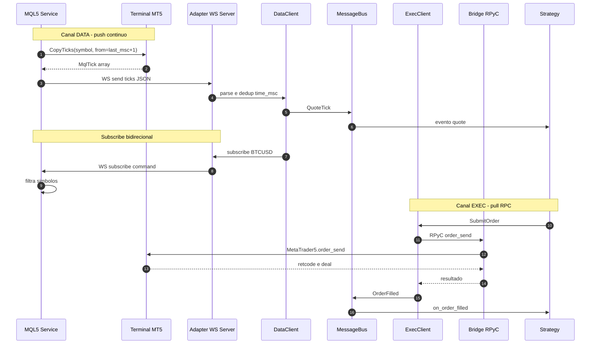

# Especificação: novo adaptador `nautilus_mt5` — streaming de ticks

**Status:** proposta aprovada para implementação  
**Versão:** 1.1  
**Data:** 2026-06-27  
**Documentos relacionados:** `res/pensando refactoring/anotacoes.md`, `res/pensando refactoring/estudo comparativo das possibilidades de impelementacao.md`, `res/pensando refactoring/refs mql5 services and ws.md`, `docs/adapter_contract.md`, `docs/terminal_access_contract.md`

---

## 1. Resumo executivo

O adaptador `nautilus_mt5` passará a obter **dados live** (quote ticks) via **push** desde um **MQL5 Service** (`CopyTicks` + cursor `time_msc`), transportados por **WebSocket** para um **WS server no adaptador** (Linux / TradingNode). **Execução** e **dados históricos on-demand** continuam via **RPyC** numa **bridge mínima** colada ao terminal MT5 (Docker+Wine ou Windows nativo).

Esta arquitetura substitui o polling actual de `symbol_info_tick` via RPyC (~1 Hz), que devolve apenas o último tick e não cumpre streaming tick-a-tick fiel.

**Decisão central (Opção B):** WS server no adaptador; bridge RPyC só passthrough; MQL5 Service como WS client.

---

## 2. Problema e motivação

| Aspecto | Estado actual | Problema |
|---------|---------------|----------|
| Live quotes | Poll RPyC `symbol_info_tick` ~1 Hz | Snapshot; perde ticks intermediários |
| Fidelidade | Um tick por ciclo de poll | Não é streaming real |
| Homologação D02 | Valida estabilidade do poll | Não valida stream tick-a-tick |

**Alternativas descartadas:**

- **EA + `OnTick`:** exige gráfico; perda de ticks sob carga; pior multi-símbolo.
- **Poll RPyC mais rápido:** continua snapshot; aumenta carga na bridge.
- **EA/DLL/ZeroMQ:** fora do objectivo (sem EA no chart, sem DLL externa).
- **WS server na bridge:** duplica lógica; bridge deixa de ser mínima.

---

## 3. Objectivos e não-objectivos

### Objectivos

1. Streaming live de quote ticks com **catch-up** via `CopyTicks` e cursor `time_msc`.
2. Manter **execução** e **histórico** via API MT5 nativa (RPyC), alinhado com `docs/adapter_contract.md`.
3. **Bridge mínima** no container (ou junto ao terminal Windows): só RPyC passthrough.
4. **Adaptador Nautilus** com camadas inspiradas em BitMEX/Deribit (DataClient fino + feed handler), em **Python puro** (fase 1, sem Rust).
5. **Evitar polling** no canal de live data.

### Não-objectivos (fase 1)

- Reimplementar adaptador em Rust/pyo3.
- WS server na bridge.
- Substituir RPyC por WS para execução.
- Clonar literalmente BitMEX/Deribit (direcção WS invertida).
- Remover legado `MT5Ext`/EA_IPC de imediato (marcar obsoleto para live data).

---

## 4. Premissas de deploy

### 4.1 Deploy principal: Docker + Wine (Linux)

```
┌─ Docker (Linux) — MT5 Terminal Environment ─────────────┐
│  Wine + terminal64.exe                                   │
│  MQL5 Service (#property service, CopyTicks, WS client)  │
│  Python (Wine) + MetaTrader5 + mt5_bridge.py (RPyC :18812)│
└──────────────────────────────────────────────────────────┘
         │ WS push                          │ RPyC RPC
         ▼                                  ▼
┌─ Linux host — TradingNode / nautilus_mt5 ────────────────┐
│  WS server (feed gateway) :8765                          │
│  RPyC client → container:18812                           │
└──────────────────────────────────────────────────────────┘
```

- A bridge **corre dentro do container**, junto ao terminal (IPC Wine). **Não** no host Windows separado a “falar com Docker”.
- O adaptador acede ao container via portas expostas (`18812` RPyC, reachability WS do Service para o host).

**Ordem operacional (v1):** (1) TradingNode / DataClient sobe o WS server; (2) arrancar manualmente o MQL5 Service (Navigator → Services → Start); (3) Service liga-se ao adaptador e envia `hello`; (4) bridge RPyC deve já estar activa para exec/histórico e carga de instrumentos. O Service **não** é iniciado pelo adaptador.

### 4.2 Variante: MT5 nativo Windows

Mesma topologia lógica; MT5 + Service + bridge na máquina Windows; adaptador no Linux com WS server + RPyC client via LAN. A bridge **continua colada ao terminal**.

### 4.3 Modo de acesso Nautilus

- **`EXTERNAL_RPYC`:** modo principal para exec + histórico.
- **`LOCAL_PYTHON`:** fora do scope desta spec para live feed (sem Service MQL5).
- Live ticks **não** dependem de RPyC após migração; RPyC continua necessário para instrumentos, exec e histórico on-demand.

---

## 5. Arquitectura lógica

### 5.1 Três papéis (não confundir)

| Módulo | Linguagem | Onde corre | Papel |
|--------|-----------|------------|-------|
| **MQL5 Service** | MQL5 | Dentro do MT5 | `CopyTicks`, cursor, WS **client** → adaptador |
| **`MT5Service` (bridge)** | Python (Wine) | `mt5_bridge.py` no container | RPyC **server**; passthrough MT5 API |
| **`nautilus_mt5`** | Python (Linux) | TradingNode | WS **server** (data) + RPyC **client** (exec/hist) + domínio Nautilus |

### 5.2 Canais de comunicação

| Canal | Direcção | Protocolo | Uso |
|-------|----------|-----------|-----|
| **Feed live** | Service → Adaptador (ticks); Adaptador → Service (subscribe/unsubscribe/ping) | WebSocket (`ws://`) | Push de ticks; comandos de subscrição |
| **Exec + histórico + instrumentos** | Adaptador → Bridge | RPyC TCP `:18812` | `order_send`, `account_info`, `symbols_get`, `copy_rates_*`, `copy_ticks_*` on-demand |

**Analogia Nautilus:** BitMEX usa WS client → exchange (live) + HTTP (requests). MT5 **inverte** o WS (Service liga-se ao adaptador) porque MQL5Book só implementa WS **client**.

### 5.3 Diagrama de componentes



### 5.4 Fronteiras de responsabilidade

| ID | Módulo | Responsabilidade | Protocolo |
|----|--------|------------------|-----------|
| A | MQL5 Service | Catch-up ticks, cursor, push JSON bruto | — |
| B | WS Service→Adaptador | Transporte live, subscribe bidireccional | `ws://` |
| C | Adaptador DataClient + Handler | Parse, dedup, `QuoteTick`, MessageBus | interno |
| D | Adaptador ExecClient | Ordens, conta, reconciliação Nautilus↔MT5 | — |
| E | Bridge RPyC | Passthrough API MT5; **sem** ticks live | TCP `:18812` |
| F | Terminal MT5 | Fonte de verdade broker | nativo |

### 5.5 O que fica dentro / fora de cada caixa

**Bridge (`mt5_bridge.py`) — só isto:**

- RPyC server (`MT5Service(rpyc.Service)`).
- `MetaTrader5.initialize()` / shutdown lifecycle.
- RPC: exec, conta, símbolos, histórico (`copy_rates_*`, `copy_ticks_*`, etc.).
- **Sem** WS server, **sem** parse Nautilus, **sem** poll de ticks para live data.

**Adaptador (`nautilus_mt5`) — o pesado:**

- Pacote `feed/`: gateway WS server + handler + protocolo wire.
- `MetaTrader5DataClient` fino (estilo BitMEX `BitmexDataClient`).
- Parse → `QuoteTick`; dedup `time_msc`; `SubscriptionState`.
- RPyC client partilhado para ExecClient e `_request_*` históricos.
- Homologação D02 passa a validar **stream real**.

**MQL5 Service — origem do stream:**

- `#property service` + loop `OnStart` + `Sleep`.
- `CopyTicks(symbol, ticks, COPY_TICKS_ALL, last_msc + 1, count)`.
- WS client (MQL5Book `ws/` ou fork tarasyyyk).
- Consome `subscribe` / `unsubscribe` / `ping` do adaptador.

---

## 6. Estrutura de código proposta (`nautilus_mt5`)

Inspirada em BitMEX/Deribit ([adapters.md](https://github.com/nautechsystems/nautilus_trader/blob/develop/docs/developer_guide/adapters.md)), **direcção WS invertida**, Python-only fase 1.

```
nautilus_mt5/
├── feed/
│   ├── __init__.py
│   ├── config.py           # FeedGatewayConfig (host, port, timeouts)
│   ├── messages.py         # tipos wire JSON (Hello, TickBatch, ...)
│   ├── handler.py          # InboundFeedHandler: parse, dedup, SubscriptionState
│   └── gateway.py          # InboundFeedGateway: websockets.serve, 1 conn Service
├── data.py                 # MetaTrader5DataClient fino
├── execution.py            # MetaTrader5ExecutionClient (RPyC; sem mudança de fronteira)
├── client/                 # RPyC: exec + requests históricos (sem poll live)
├── config.py               # + FeedGatewayConfig em DataClientConfig
├── factories.py            # DataClient instancia feed; client RPyC partilhado
└── ...
```

### 6.1 Mapeamento BitMEX → MT5

| BitMEX / Deribit | MT5 proposto |
|------------------|--------------|
| `BitmexWebSocketClient` (outer, WS client) | `InboundFeedGateway` (WS **server**) |
| `BitmexWsFeedHandler` | `InboundFeedHandler` |
| `BitmexWsMessage` / frames | `feed/messages.py` |
| `BitmexHttpClient` (requests) | `MetaTrader5Client` RPyC |
| `BitmexDataClient._handle_msg` | `MetaTrader5DataClient._handle_feed_msg` |
| `SubscriptionState` | Reutilizar padrão (implementação Python simples) |

### 6.2 Legado a deprecar (live data)

| Componente | Acção |
|----------|-------|
| Poll `_run_terminal_incoming_msg_reader` / `symbol_info_tick` loop | Remover do caminho live |
| `data_stream.pyx` / EA stream ports 15557/15558 | Substituir por `feed/` ou remover após migração |
| `MT5Ext.mq5` + `OnTick` | Manter só referência; **não** modelo para streaming novo |
| `TerminalConnectionMode.EA_IPC` para homologação live | Obsoleto para D01/D02 pós-migração |

---

## 7. MQL5 Service — especificação

### 7.1 Requisitos

- `#property service` — arranque manual: Navigator → Services → Add → Start.
- Loop em `OnStart`:

```mql5
void OnStart()
{
   while(!IsStopped())
   {
      process_websocket_commands();   // checkMessages / subscribe
      export_new_ticks_copyticks(); // CopyTicks + cursor
      Sleep(10);                    // configurável via input
   }
}
```

- **Sem** EA no chart; **sem** DLL externa.
- WebSocket: MQL5Book `Include/MQL5Book/ws/` ou [tarasyyyk/mql5-websocket](https://github.com/tarasyyyk/mql5-websocket).
- URL WS whitelisted: MetaTrader → Tools → Options → Expert Advisors → allow WebRequest/lista de URLs.

### 7.2 Algoritmo CopyTicks (cursor)

Baseado em [MQL5 Book — timeseries_ticks_mqltick](https://www.mql5.com/en/book/applications/timeseries/timeseries_ticks_mqltick) e [LoRio #56324](https://www.mql5.com/en/code/56324):

1. Manter `last_msc` por símbolo subscrito.
2. Chamar `CopyTicks(symbol, ticks, COPY_TICKS_ALL, last_msc + 1, batch_size)`.
3. Se `n > 0`, actualizar `last_msc = ticks[n-1].time_msc`.
4. Enviar batch via WS (`op: ticks`).
5. **Nota:** vários ticks no mesmo `time_msc` — considerar contagem de duplicados (livro MQL5); dedup adicional no adaptador.

### 7.3 Inputs sugeridos (Service)

| Input | Descrição | Default sugerido |
|-------|-----------|------------------|
| `InpWsUrl` | URL do adaptador | `ws://host.docker.internal:8765/mt5-feed` |
| `InpSleepMs` | Intervalo do loop | `10` |
| `InpBatchSize` | Max ticks por CopyTicks | `1000` |
| `InpSymbols` | Símbolos iniciais (opcional) | vazio → só via subscribe |

### 7.4 Localização no repo

- `MQL5/Services/NT5TickFeedService.mq5` (nome provisional).
- Includes: `MQL5/Include/` (MQL5Book `ws/` quando adicionados).

---

## 8. Bridge RPyC — especificação

### 8.1 Responsabilidades

- Expor superfície RPC mínima já definida em `docs/terminal_access_contract.md`.
- Correr **no mesmo ambiente** que o terminal (Wine no container).
- **Não** iniciar WS; **não** traduzir ticks para Nautilus.

### 8.2 Fora de scope da bridge

- Dedup, `QuoteTick`, subscriptions Nautilus.
- Qualquer loop de `symbol_info_tick` para alimentar adaptador.

---

## 9. Protocolo wire (Service ↔ Adaptador)

JSON por mensagem WebSocket (text frame). Sem JSON-RPC pesado (1 cliente MQL5).

### 9.1 Service → Adaptador

| `op` | Campos | Descrição |
|------|--------|-----------|
| `hello` | `session`, `terminal`?, `account`?, `symbols[]` | Handshake após connect (`terminal`/`account` opcionais) |
| `ticks` | `symbol`, `cursor`, `data[]` | Batch de ticks; `cursor` = `time_msc` do último tick do batch |
| `heartbeat` | `ts_msc` | Keep-alive |
| `pong` | — | Resposta a `ping` (opcional) |
| `error` | `code`, `message` | Erro reportado pelo Service |

**Tick object (`data[]`):**

```json
{
  "time_msc": 1730000000123,
  "bid": 1.08452,
  "ask": 1.08455,
  "last": 0.0,
  "volume": 0,
  "flags": 6
}
```

### 9.2 Adaptador → Service

| `op` | Campos | Descrição |
|------|--------|-----------|
| `subscribe` | `symbols[]` | Activar CopyTicks para símbolos |
| `unsubscribe` | `symbols[]` | Parar export |
| `ping` | — | Resposta `pong` (opcional) |

### 9.3 Exemplos

```json
{"op":"hello","session":"svc-1","symbols":["BTCUSD"]}
{"op":"ticks","symbol":"BTCUSD","cursor":1730000000456,"data":[{"time_msc":1730000000123,"bid":95000.1,"ask":95000.3,"last":0,"volume":0,"flags":6}]}
{"op":"subscribe","symbols":["BTCUSD","EURUSD"]}
```

### 9.4 Regras de robustez

- **Uma** ligação WS activa do Service (v1).
- Adaptador envia `subscribe` após `SubscribeQuoteTicks` Nautilus.
- Reconnect Service: re-enviar `hello`; cursor local no Service preserva catch-up; adaptador dedup por `time_msc`.
- Timeout: se `hello` não chegar em N segundos após `_connect`, DataClient falha de forma controlada (log + estado degraded).

---

## 10. Comportamento do adaptador Nautilus

### 10.1 `MetaTrader5DataClient` — lifecycle `_connect`

Ordem inspirada em BitMEX `_connect`:

1. Validar `venue_profile`.
2. Garantir ligação RPyC activa (client partilhado no factory) — necessária para `instrument_provider.initialize()` e `_request_*`, **não** para ticks live.
3. `instrument_provider.initialize()` via RPyC (`symbols_get`, etc.).
4. `feed_gateway.start(host, port)` — WS server listening.
5. Aguardar mensagem `hello` do Service (timeout configurável; ver §12.1).
6. Re-play subscriptions pendentes via `subscribe` WS.
7. **Não** usar RPyC para live ticks (sem poll `symbol_info_tick`).

### 10.2 `_disconnect`

1. Parar feed gateway (fechar WS).
2. Cancelar tasks asyncio do handler.
3. Não desligar RPyC aqui se ExecClient ainda activo (client partilhado no factory).

### 10.3 Subscriptions

| Nautilus | Acção |
|----------|-------|
| `_subscribe_quote_ticks` | `feed_gateway.subscribe(symbol)` → WS `subscribe` |
| `_unsubscribe_quote_ticks` | `feed_gateway.unsubscribe(symbol)` → WS `unsubscribe` |
| `_request_quote_ticks` / `_request_bars` | RPyC on-demand (`copy_ticks_*`, `copy_rates_*`) — **não** poll |

### 10.4 `_handle_feed_msg`

Ponto único de entrada (estilo `BitmexDataClient._handle_msg`):

- `ticks` → parse → dedup `time_msc` → `QuoteTick` → `_handle_data`.
- `hello` / `heartbeat` → estado interno gateway.
- `error` → log warning; não crash operacional.

### 10.5 `MetaTrader5ExecutionClient`

- Sem alteração de fronteira: RPyC via `MetaTrader5Client` partilhado.
- Reconciliação periódica de ordens (padrão Nautilus ExecClient) **permitida** — não confundir com poll de ticks.

---

## 11. Política de polling

| Mecanismo | Poll? | Veredicto |
|-----------|-------|-----------|
| Loop Service + CopyTicks + WS push | Não | **Canal live oficial** |
| WS push → handler → MessageBus | Não | OK |
| `RequestBars` / `RequestQuoteTicks` via RPyC | On-demand | OK (spec Nautilus) |
| `symbol_info_tick` em loop (~1 Hz) | Sim | **Eliminar** para live |
| Reconciliação open orders (ExecClient) | Pode ser periódica | OK (exec, não data) |

---

## 12. Configuração proposta

### 12.1 Novos campos (DataClient)

Adicionar a `MetaTrader5DataClientConfig` (ou struct aninhada `FeedGatewayConfig`):

| Campo | Default | Descrição |
|-------|---------|-----------|
| `feed_enabled` | `True` | Usar WS feed vs legado poll (transição) |
| `feed_host` | `0.0.0.0` | Bind do WS server |
| `feed_port` | `8765` | Porta WS |
| `feed_path` | `/mt5-feed` | Path WS |
| `feed_hello_timeout_secs` | `30.0` | Timeout à espera de `hello` |
| `feed_reconnect_notify` | `True` | Log em reconnect Service |

`external_rpyc` mantém-se para exec/histórico (`host`, `port` default `18812`).

Com `feed_enabled=True`, o DataClient **exige** Service MQL5 a correr e a ligar-se dentro de `feed_hello_timeout_secs`; caso contrário, falha de forma controlada (não volta silenciosamente ao poll legado). Durante a transição de implementação, `feed_enabled=False` pode manter o caminho poll até o Service estar disponível.

### 12.2 Variáveis de ambiente (Service MQL5)

Configurar no Service via inputs (não há API Python para start/stop Service).

---

## 13. Rede Docker

| Origem | Destino | Notas |
|--------|---------|-------|
| Service (container) | Adaptador WS (host) | `host.docker.internal:8765` ou IP do host; expor porta no TradingNode |
| Adaptador (host) | Bridge RPyC (container) | Mapear `18812:18812` |
| Whitelist MT5 | URL WS adaptador | Obrigatório para MQL5Book client |

---

## 14. Sequência operacional



---

## 15. Comparação arquitectural (síntese)

| Critério | Opção B + handler BitMEX-like | BitMEX literal | Deribit literal | Poll RPyC actual |
|----------|------------------------------|----------------|-----------------|------------------|
| Facilidade impl. | Média | Baixa | Baixa | Alta |
| Robustez live | Alta | N/A | N/A | Baixa |
| Alinhamento Nautilus | Alta | Alta (estrutura) | Alta (estrutura) | Média |
| Docker+Wine | Alta | N/A | N/A | Média |
| Sem poll live | Sim | Sim | Sim | Não |

Ver detalhe em `res/pensando refactoring/estudo comparativo das possibilidades de impelementacao.md`.

---

## 16. Plano de implementação (ordem Nautilus)

Seguir `docs/adapter_contract.md` — Implementation sequence:

| Fase | Entrega |
|------|---------|
| **1** | MQL5 Service MVP: CopyTicks + WS client + `hello`/`ticks` |
| **2** | `nautilus_mt5/feed/`: gateway + handler + messages + testes unitários parse/dedup |
| **3** | `MetaTrader5DataClient`: `_connect`, `_subscribe_quote_ticks`, `_handle_feed_msg`; flag `feed_enabled` |
| **4** | Remover poll live de `MetaTrader5Client` mixins; RPyC só exec + `_request_*` |
| **5** | Homologação: actualizar TC-HOM-D02 para stream real; actualizar `docs/data_capability_matrix.md` |
| **6** | Docs: README, examples, capability matrices |

### 16.1 Critérios de aceitação (MVP)

- [ ] Service envia batches `ticks` com `cursor` (`time_msc` do último tick) não-decrescente por símbolo.
- [ ] Adaptador emite `QuoteTick` no MessageBus sem poll RPyC.
- [ ] `SubscribeQuoteTicks` / `UnsubscribeQuoteTicks` reflectidos no Service.
- [ ] Exec round-trip (TC-HOM-E01) inalterado via RPyC.
- [ ] D02: stream sustentado com gaps dentro do limite configurado (ticks reais, não poll).
- [ ] Bridge sem WS server e sem lógica Nautilus.

---

## 17. Testes

| Camada | Tipo | Foco |
|--------|------|------|
| `feed/messages.py`, `handler.py` | Unit (Tier 1) | Parse JSON, dedup, subscription state |
| `feed/gateway.py` | Integration | WS server + cliente fake |
| Adaptador + fake feed | Integration | DataClient `_connect` / subscribe |
| Homologação (`homologation/`) | Aceitação manual / CI selectivo | Service real + bridge + conta paper (não substituir Tier 1 pytest) |
| RPyC | Existing fake bridge | Exec/histórico unchanged |

Consultar `docs/testing_contract.md` e fake bridge existente; estender fake com **WS feed simulator** se necessário (Tier 1).

---

## 18. Referências de implementação

### MQL5 (sem EA/DLL)

| Peça | Referência |
|------|------------|
| CopyTicks + cursor | [LoRio #56324](https://www.mql5.com/en/code/56324), [MQL5 Book ticks](https://www.mql5.com/en/book/applications/timeseries/timeseries_ticks_mqltick) |
| Service shell | [Swap Monitor #53007](https://www.mql5.com/en/code/53007), [Book Services](https://www.mql5.com/en/book/applications/script_service/services) |
| WS client | [MQL5Book ws/](https://www.mql5.com/en/book/advanced/project/project_websocket_mql5), [tarasyyyk/mql5-websocket](https://github.com/tarasyyyk/mql5-websocket) |

Lista completa: `res/pensando refactoring/refs mql5 services and ws.md`.

### Nautilus (estrutura)

- [BitMEX data.py](https://github.com/nautechsystems/nautilus_trader/blob/develop/nautilus_trader/adapters/bitmex/data.py)
- [BitMEX websocket/handler.rs](https://github.com/nautechsystems/nautilus_trader/blob/develop/crates/adapters/bitmex/src/websocket/handler.rs)
- [Deribit integration](https://github.com/nautechsystems/nautilus_trader/blob/develop/docs/integrations/deribit.md)
- [Adapter developer guide](https://github.com/nautechsystems/nautilus_trader/blob/develop/docs/developer_guide/adapters.md)

---

## 19. Riscos e mitigações

| Risco | Mitigação |
|-------|-----------|
| Service desconecta WS | Reconnect + cursor `time_msc`; dedup no adaptador |
| Gap rede container→host | Monitor D02; documentar `host.docker.internal` |
| `CopyTicks` sync lenta (45s) | Limitar `InpBatchSize`; evitar sync massivo no arranque; log no Service; exec RPyC corre em processo Python separado |
| Múltiplos ticks mesmo `time_msc` | Dedup no adaptador; algoritmo livro MQL5 |
| Única conn WS | v1 accept; multi-terminal = multi-container futuro |
| Transição legado | Flag `feed_enabled`; deprecar poll gradualmente |

---

## 20. Itens deferidos

- Rust/pyo3 feed layer.
- WS TLS (`wss://`) entre container e host.
- Multi-instância Service ou multi-conn WS.
- Trade ticks live (se MT5/broker disponibilizar via flags CopyTicks).
- Actualização automática de `docs/decisions.md` (registar ADR formal na implementação).

---

## 21. Glossário

| Termo | Significado |
|-------|-------------|
| **Opção B** | WS server no adaptador; bridge RPyC mínima |
| **MQL5 Service** | Script `#property service` dentro do terminal MT5 |
| **Bridge / `MT5Service`** | `mt5_bridge.py` — RPyC server Python; **não** confundir com MQL5 Service |
| **Feed gateway** | WS server asyncio no DataClient |
| **Cursor** | `last_msc` por símbolo no Service |
| **Passthrough** | Bridge expõe MT5 API sem semântica Nautilus |

---

*Este documento é a base para os trabalhos de migração do `nautilus_mt5`. Alterações arquitecturais devem actualizar este ficheiro e, quando aplicável, `docs/decisions.md` e as capability matrices.*
