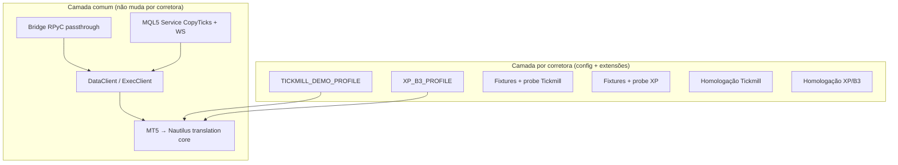

## Princípio orientador

O objetivo não é “dois adaptadores”, e sim **um adaptador MT5 multi-corretora** com três eixos separados:

1. **Infraestrutura comum** — bridge RPyC, MQL5 Service/WS, DataClient, ExecClient (já genéricos).
2. **Perfil de broker (`VenueProfile`)** — o que cada corretora expõe de fato (tipos de instrumento, quote vs trade ticks, DOM, etc.).
3. **Homologação por broker** — evidência empírica, não suposição.

Tickmill e XP compartilham o canal MT5; divergem na **semântica do mercado** (OTC vs bolsa).

---

## Visão em camadas



---

## Fase 0 — Consolidar a base comum (Tickmill como referência)

Antes de abrir XP, fechar o que ainda é “um broker só” na prática:

| Item | Por quê |
|------|---------|
| Concluir feed WS (spec `especificacao_novo_adaptador_nautilus_mt5.md`) | Live data genérico MT5, não específico Tickmill |
| Garantir que homologação Tickmill está estável | Baseline de regressão |
| Remover acoplamentos hardcoded a Tickmill em harnesses | Hoje `homologation/node_factory.py`, suites, etc. usam `TICKMILL_DEMO_PROFILE` fixo |
| Parametrizar homologação por `venue_profile` + broker server | Mesmo runner, perfil/config diferente |

**Critério de saída:** trocar só config (`venue_profile`, símbolos, `account_id`) sem alterar código de produção.

---

## Fase 1 — Metodologia de descoberta por broker (probe → perfil)

Replicar o padrão de `res/tickmill_restrictions.md` para XP:

1. Logar no MT5 XP (demo ou real, conforme disponível).
2. Rodar `teste_intrumento_infos.mq5` em símbolos representativos:
   - **B3 futuros:** WIN, WDO (contrato corrente)
   - **Ações B3:** PETR4, VALE3 (se relevante)
   - Um símbolo FX/CFD XP, se existir (para comparar com Tickmill)
3. Documentar em `res/xp_b3_restrictions.md` (ou similar):
   - `trade_calc_mode` por símbolo
   - ticks: bid/ask, `last`, volume, flags
   - DOM (`ticks_bookdepth`, `MarketBookAdd`)
   - sessões, spread, lotes, filling mode
   - tipo de conta (hedging vs netting)
4. Capturar fixtures JSON (`examples/capture_symbol_info_fixtures.py`) com metadados do servidor XP.

**Saída:** evidência empírica, não o perfil “no achismo”.

---

## Fase 2 — Expandir `VenueProfile` (configuração, não fork)

Criar **`XP_B3_PROFILE`** (nome a definir) declarando, por `trade_calc_mode`:

| `trade_calc_mode` | Tipo Nautilus esperado | Capabilities prováveis |
|-------------------|------------------------|-------------------------|
| `EXCH_FUTURES` (7) | `FuturesContract` | quote + **trade** ticks, bars |
| `EXCH_STOCKS` (6) | `Equity` | quote + trade ticks, bars |
| OTC (se XP tiver) | `Cfd` / `CurrencyPair` | conforme probe |

Manter **`TICKMILL_DEMO_PROFILE`** intacto — perfis coexistem; o utilizador escolhe na config:

```python
MetaTrader5DataClientConfig(..., venue_profile=XP_B3_PROFILE)
```

**Regra:** nunca hardcodar lógica “if tickmill / if xp” no core; só `venue_profile.check_capability()` e parsing por `trade_calc_mode`.

---

## Fase 3 — Completar parsing de instrumentos (gap principal para B3)

Hoje o parser só implementa `CurrencyPair` e `Cfd`. Para XP/B3:

1. **`parse_futures_contract`** — WIN/WDO: tick size, multiplicador, expiry, moeda BRL.
1. **`parse_futures_contract`** — DI1*: tick size, multiplicador, expiry, moeda BRL.
2. **`parse_equity_contract`** — ações B3 (se no escopo).
3. **Symbol mapping** — sufixos XP (`WIN$`, rollover), normalização `InstrumentId`.
4. **Calendário/sessão** — horários B3 (pré-abertura, leilão, after) se estratégias dependem disso.

Ordem alinhada com `docs/adapter_contract.md`: **instrumentos primeiro**, depois data/exec.

**Critério de saída:** `InstrumentProvider.load_async()` carrega WIN/WDO na XP sem `ValueError`.

---

## Fase 4 — Dados de mercado multi-perfil

| Capability | Tickmill | XP/B3 (esperado) | Trabalho |
|------------|----------|------------------|----------|
| Quote ticks (WS) | OK | Mesmo path | Validar símbolos B3 no Service |
| Trade ticks | UNSUPPORTED | Provavelmente SUPPORTED | Habilitar via profile; mapear `last`/volume/flags |
| Order book | UNSUPPORTED | Probe decide | Só implementar se probe confirmar |
| Bars históricos | OK | Mesmo RPyC | Testar timeframes/sessão B3 |
| Dedup ticks | `time_msc` | Idem | Pode haver mais volume em bolsa |

O feed MQL5 (`CopyTicks`) e o handler são **genéricos**; a diferença está no **mapeamento para `QuoteTick` vs `TradeTick`**, guiado pelo profile.

---

## Fase 5 — Execução multi-perfil

A API `order_send` é a mesma; o que muda:

1. **Filling mode / TIF** — validar na XP (DAY comum em B3; IOC/FOK podem diferir).
2. **Quantidades** — futuros mini (1 contrato) vs lotes FX Tickmill.
3. **Stops / freeze level** — `trade_stops_level` por símbolo.
4. **Reconciliação** — `history_deals_get` na XP (timing pode diferir da Tickmill).
5. **Conta hedging vs netting** — impacto em close/modify.

Manter guards pré-venue (`validate_order_pre_venue`) genéricos; regras específicas entram no profile ou em tabelas de mapping testadas com fixtures XP.

---

## Fase 6 — Testes em duas camadas (contrato do projeto)

### Tier 1 — Determinístico (sempre no CI)

- Fixtures JSON Tickmill **e** XP.
- Testes unitários de parsing por `trade_calc_mode`.
- Testes de gating `VenueProfile` (Tickmill rejeita trade ticks; XP aceita).
- Fake bridge + fake WS feed — **sem depender de corretora live**.
- Parametrizar testes: `@pytest.mark.parametrize("profile", [TICKMILL_DEMO_PROFILE, XP_B3_PROFILE])` onde fizer sentido.

### Tier 2 — Live / homologação

- `res/proximos testes adaptador.md` → generalizar para multi-broker.
- Suites `homologation/` aceitam `--profile xp_b3 --symbol WIN$ ...`.
- Matrizes `docs/data_capability_matrix.md` e `docs/execution_capability_matrix.md` com coluna **por perfil** ou notas “Tickmill / XP”.

**Regra:** não promover capability na matrix sem probe + teste (Tier 1 ou Tier 2 conforme critério).

---

## Fase 7 — Configuração e operação

Expor na config/factory (sem novo adaptador):

| Campo | Função |
|-------|--------|
| `venue_profile` | Perfil de capabilities |
| `account_id` | Login MT5 (fonte de verdade) |
| `load_symbols` / filtros | Símbolos do broker |
| `feed_*` | WS (igual para todos) |
| `external_rpyc` | Bridge (igual para todos) |

Exemplos README: `examples/tickmill_demo.py` e `examples/xp_b3_demo.py` — mesma factory, configs diferentes.

Deploy: mesma topologia Docker+Wine ou Windows nativo; só muda terminal logado (Tickmill vs XP).

---

## Fase 8 — Documentação viva

| Documento | Ação |
|-----------|------|
| `docs/venue_profile.md` | Perfil XP oficial + comparação Tickmill vs XP |
| `res/xp_b3_restrictions.md` | Probe XP (espelho Tickmill) |
| Capability matrices | Status por perfil |
| `docs/decisions.md` | ADR se algo for específico B3 (ex.: rollover de futuros) |

---

## Ordem de execução recomendada (roadmap)

```
0. Estabilizar Tickmill + desacoplar harnesses hardcoded
1. Probe XP + fixtures + XP_B3_PROFILE (declarativo)
2. Parser FuturesContract (+ Equity se necessário)
3. Data: trade ticks + homologação quote stream B3
4. Exec: market/limit/stop na XP + reconciliação
5. Testes Tier 1 parametrizados + Tier 2 XP
6. Docs + examples + matrix atualizada
```

Trabalho **paralelizável:** enquanto alguém faz probe XP, outro pode generalizar homologação e implementar `parse_futures_contract` com fixtures sintéticas baseadas na doc MQL5.

---

## O que evitar

- **Novo adaptador `nautilus_xp`** — duplica bridge, feed, testes.
- **`if broker == "XP"` espalhado** — usar sempre `VenueProfile`.
- **Assumir que B3 = trade ticks** — confirmar com probe (como fizeram com Tickmill).
- **Quebrar Tickmill** — cada PR multi-broker deve manter suite Tickmill verde.
- **Promover capabilities na matrix antes da evidência**.

---

## Definição de “pronto para os dois brokers”

O adaptador suporta Tickmill **e** XP quando:

1. Dois `VenueProfile` documentados e exportados.
2. Parsing + provider funcionam para símbolos representativos de cada perfil.
3. Data live (WS) e exec (RPyC) homologados live em cada broker (ou matrix marca claramente o que falta).
4. CI Tier 1 cobre ambos os perfis com fixtures.
5. Nenhuma lógica de produção referencia nome de corretora — só profile + metadados MT5.

---

## Esforço relativo (expectativa realista)

| Área | Esforço Tickmill→XP |
|------|---------------------|
| Bridge + WS + RPyC | **Baixo** (já genérico) |
| VenueProfile + probe | **Baixo/médio** |
| Parser futuros/ações | **Médio** (principal gap) |
| Trade ticks | **Médio** (novo path vs Tickmill) |
| Exec + TIF/filling B3 | **Médio** |
| Rollover/símbolos B3 | **Médio/alto** (se automático) |
| Homologação live XP | **Médio** (depende de conta/demo) |

Em resumo: **80% da arquitetura já serve os dois**; o investimento está em **perfil + parsing + validação empírica XP**, não em reescrever o adaptador.
