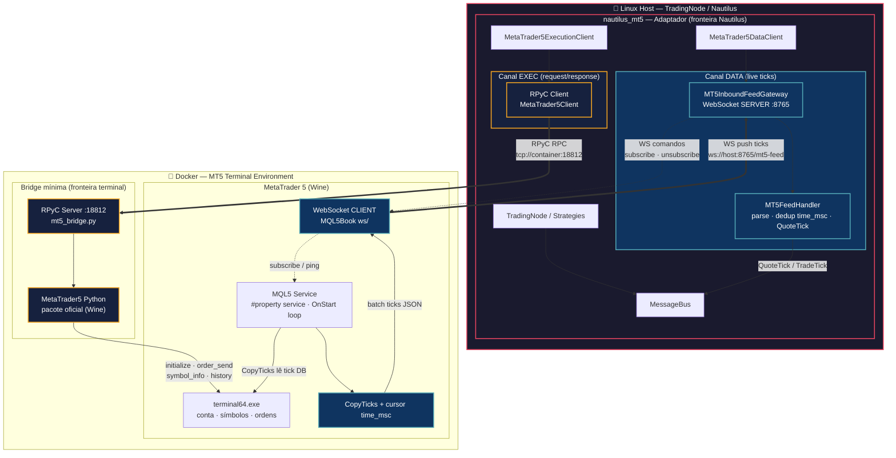
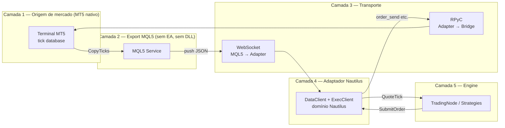
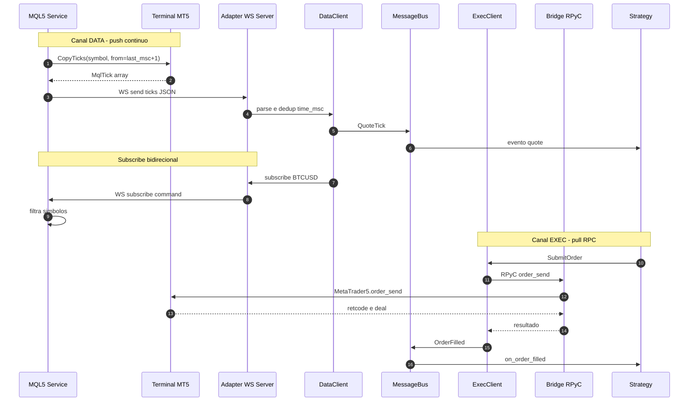
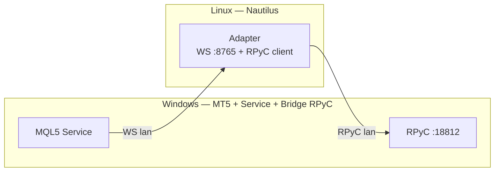
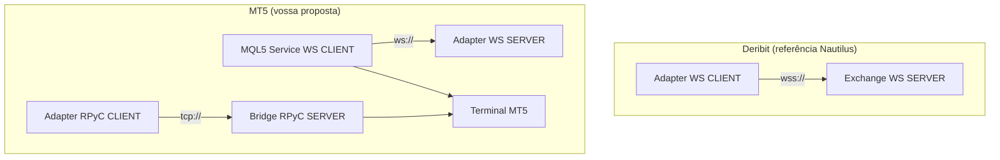

## MQL5 Services
void OnStart()
{
   while(!IsStopped())
   {
      ler_comandos_do_websocket();
      buscar_ticks_novos_no_terminal();
      enviar_ticks_novos_para_o_nautilus();
      Sleep(10);
   }
}
## Websockets
MetaQuotes / MQL5Book WebSocket
MQL5/Include/MQL5Book/ws/
    wsclient.mqh
    wsframe.mqh
    wsinterfaces.mqh
    wsmessage.mqh
    wsprotocol.mqh
    wstools.mqh
    wstransport.mqh

https://github.com/tarasyyyk/mql5-websocket
tarasyyyk/mql5-websocket

## Trades
#include <Trade/Trade.mqh>
#include <Trade/PositionInfo.mqh>
#include <Trade/OrderInfo.mqh>
#include <Trade/HistoryOrderInfo.mqh>
#include <Trade/DealInfo.mqh>
#include <Trade/AccountInfo.mqh>
#include <Trade/SymbolInfo.mqh>

Acima do CTrade original
MQL_Easy	Boa inspiração de API
EA31337-classes	Boa referência de arquitetura/edge cases, mas pesado

## Decisão: Service + CopyTicks + cursor (streaming de ticks)

**Problema:** o adaptador hoje faz polling via `symbol_info_tick` (~1 Hz, RPyC) — devolve só o último tick, perde intermediários e não é streaming real.

**Alternativas descartadas:**
- **EA + `OnTick`:** exige gráfico aberto; em mercado líquido o handler pode atrasar e perder ticks; pior para multi-símbolo.
- **Poll Python/RPyC mais rápido:** continua snapshot do último tick, mais carga na bridge.

**Escolha:** **MQL5 Service** em background (sem chart) + loop em `OnStart` + **`CopyTicks` com cursor `time_msc`** + push via **WebSocket** para o adaptador `nautilus_mt5` (WS server).

**Por quê:**
- Service sobe com o terminal, sem depender de EA no gráfico.
- `CopyTicks(from=last_msc)` recupera **lote de ticks novos** desde o último enviado (catch-up), não só o último.
- Mais completo que `OnTick` sob carga; melhor para burst e multi-símbolo.
- Execução permanece via RPyC; só o canal de **data live** muda.

**Riscos/limites:** intervalo do loop, limite de `count` por chamada, profundidade do histórico de ticks do broker; dedup por `time_msc`.

**Stack:** MQL5Book `ws/` (client, Service) → WS server no adaptador (Linux) · RPyC client no adaptador → bridge `:18812` (exec e histórico).

## Estratégia para implementar a nova versão do adaptador com streaming de ticks e quotes

Diagrama da proposta **Opção B**: WS server no adaptador Linux, bridge RPyC mínima no container MT5, Service MQL5 como cliente WS.

### Organização geral
| Peça | Onde fica |
|------|-----------|
| **`MT5Service` (RPyC server)** | **Fora** do `nautilus_mt5` — bridge mínima (`mt5_bridge.py`) |
| **Adaptador `nautilus_mt5`** | WS server (data), RPyC **client** (exec), parse, `QuoteTick`, MessageBus, homologação |
| **MQL5 Service** | **Fora** do adaptador — `MQL5/Services/`, corre **dentro** do terminal MT5 |

Ou seja: a bridge fica burra (só passthrough MT5 API); o “pesado” Nautilus fica no adaptador.

```
┌─ Docker (Linux) ─────────────────────────────┐
│  Wine + terminal64.exe (MT5)                 │
│  MQL5 Service (CopyTicks + WS client)        │
│  Python (Wine) + MetaTrader5 package         │
│  MT5Service (rpyc.Service) :18812  ◄─ AQUI  │
└──────────────────────────────────────────────┘
         ▲ WS push                    ▲ RPyC
         │                            │
┌────────┴────────────────────────────┴────────┐
│  Linux host — nautilus_mt5 (adaptador)       │
│  WS server :8765  +  RPyC client → :18812    │
└──────────────────────────────────────────────┘
```

### Três papéis distintos (não confundir)

| Módulo | Linguagem | Processo | Papel |
|--------|-----------|----------|--------|
| **MQL5 Service** | MQL5 | Dentro do MT5 (container) | CopyTicks, cursor, WS **client** → adaptador |
| **`MT5Service` (bridge)** | Python (Wine no container) | `mt5_bridge.py` no container | RPyC **server**, expõe `order_send`, `account_info`, etc. |
| **`nautilus_mt5`** | Python (Linux nativo) | TradingNode | WS **server** (ticks) + RPyC **client** (exec) + domínio Nautilus |

### Variante Windows (se MT5 for nativo no Windows)

Se o terminal **não** estiver em Docker e correr **nativo Windows**:

```
Windows:  MT5 + MQL5 Service + MT5Service (RPyC) + MetaTrader5 Python local
Linux:    nautilus_mt5 → RPyC client (LAN) + WS server
```

Aí sim tudo MT5-related está numa máquina Windows; o adaptador continua no Linux. Mas a bridge **continua junto ao terminal** (Windows), não “Windows a aceder ao Docker Wine” como intermediário extra.


## Arquitetura geral



---

## Vista por camadas (quem fala com quem)



---

## Fluxo de dados vs execução (sequência)




---

## Fronteiras de responsabilidade

| Fronteira | Módulo | Responsabilidade | Protocolo |
|-----------|--------|------------------|-----------|
| **A** | MQL5 Service | Catch-up ticks, cursor, push bruto | — |
| **B** | WS (A→C) | Transporte live data, subscribe | `ws://` |
| **C** | Adaptador DataClient | Parse → Nautilus, dedup, MessageBus | interno |
| **D** | Adaptador ExecClient | Tradução ordens/conta Nautilus↔MT5 | — |
| **E** | Bridge RPyC | Passthrough API MT5, sem lógica de ticks | TCP :18812 |
| **F** | Terminal MT5 | Fonte de verdade broker | nativo |

---

## O que fica **fora** de cada caixa

**Bridge (Docker) — só isto:**
- RPyC server
- `MetaTrader5.initialize()` / `order_send` / `positions_get` / histórico
- **Sem** WS server, **sem** parse Nautilus, **sem** poll de ticks para live data

**Adaptador (Linux) — o pesado:**
- WS **server** (inbound feed)
- Handler inbound feed (two-layer, inspirado no Deribit; direcção invertida — WS server, não client)
- `QuoteTick` / capability matrix / homologação D02
- RPyC **client** para exec

**MQL5 Service (Docker) — origem do stream:**
- Loop `OnStart` + `CopyTicks`
- WS **client** para o adaptador
- Recebe subscribe do adaptador via WS

---

## Variante: MT5 nativo Windows (sem Docker)

Se o terminal correr em Windows e o TradingNode em Linux, o desenho mantém-se — só mudam os endereços:



---

## Comparação rápida com Deribit



No Deribit o adaptador **liga-se** à venue. No MT5 a “venue” de ticks é o Service MQL5, que **liga-se** ao adaptador — daí o WS server ficar no adaptador, não na bridge.

Se quiseres, no próximo passo posso acrescentar um diagrama só do **protocolo JSON** Service↔adapter (`subscribe`, `ticks`, `heartbeat`, `error`).